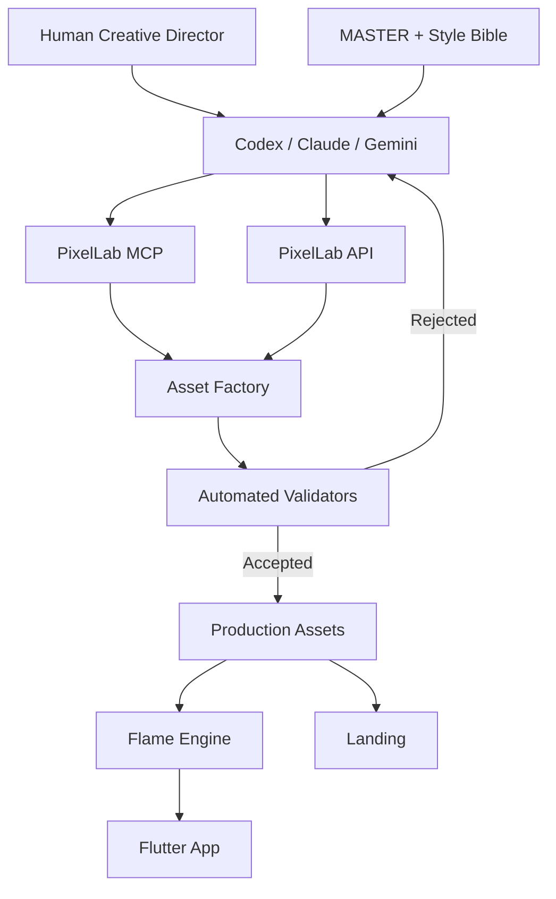

# Architecture Globale

## Lecture

La boucle critique est `FACTORY → VALIDATOR → AGENT` : un asset rejeté
retourne à l'agent avec le feedback, jamais directement en production.
Voir [[Retry-Et-Escalade]].

`MASTER` alimente l'agent mais n'est jamais modifié par lui :
[[Regle-Master-Immuable]].

Nœuds liés : [[Pipeline-Generation]], [[Validators]], [[Cycle-Vie-Asset]]

---
Source : §196
