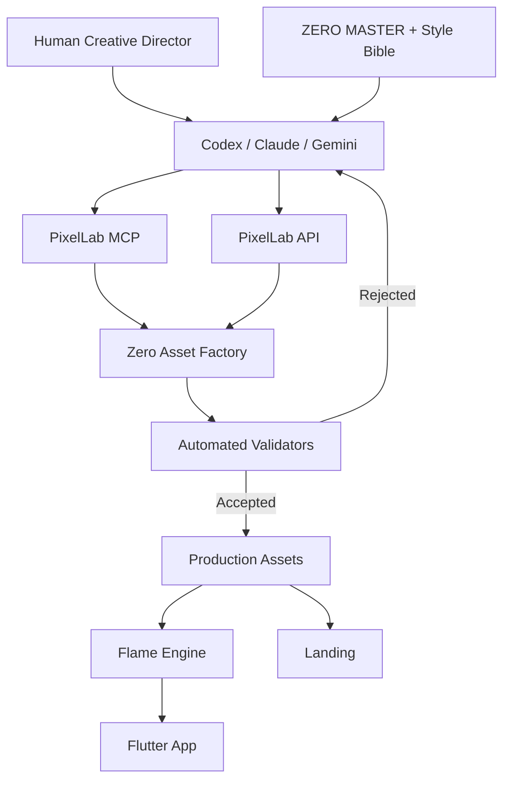

# ZÉRO — AI Asset Factory, Animation Pipeline & Pixel-Perfect Web Plan
## Master document v2.0
### Document de référence pour toi, Codex, Claude Code, Gemini CLI et les agents de développement

> **Projet :** Zéro  
> **Produit :** application mobile de compagnon animal IA en pixel-art  
> **Personnage de lancement :** Zéro, petit chat IA  
> **Principe :** Zéro pose des questions, apprend de son humain, construit des souvenirs, développe une personnalité, grandit, se personnalise, bouge en permanence et devient visuellement unique.  
> **But de ce document :** permettre à une personne non-artiste de produire le personnage, ses animations, ses accessoires, la landing page et le pipeline complet avec l'aide d'agents IA.

---

# 0. LA DÉCISION PRINCIPALE

À partir de maintenant, nous ne travaillons plus comme une équipe graphique traditionnelle.

Nous construisons un **pipeline AI-first**.

Cela signifie :

```text
TOI
 ↓
direction créative
 ↓
CODEX / CLAUDE / GEMINI
 ↓
PIXELLAB MCP / API
 ↓
ASSETS GÉNÉRÉS
 ↓
VALIDATION AUTOMATIQUE
 ↓
ACCEPT / REJECT
 ↓
SPRITE SHEETS
 ↓
FLAME
 ↓
FLUTTER
 ↓
APP MOBILE
```

Le but est que tu ne sois pas obligé de :

- dessiner pixel par pixel ;
- animer manuellement chaque frame ;
- ranger tous les fichiers à la main ;
- créer les sprite sheets à la main ;
- renommer les fichiers ;
- vérifier chaque dimension ;
- intégrer chaque asset manuellement.

Ton rôle doit être principalement :

1. choisir ;
2. valider ;
3. dire ce que tu veux modifier ;
4. décider de la direction créative.

---

# 1. CE QUE LES OUTILS FONT

## 1.1 PixelLab

PixelLab est utilisé comme **générateur de pixel-art pilotable par IA**.

Il peut servir à :

- générer un personnage pixel-art ;
- créer plusieurs directions ;
- produire des variations ;
- créer des animations ;
- produire des assets ;
- créer des environnements ;
- travailler depuis un assistant de code via MCP.

Il ne doit pas être considéré comme la source de vérité du design.

La source de vérité est :

```text
ZERO_MASTER
+
ZERO_STYLE_BIBLE
+
ZERO_PALETTE
```

---

## 1.2 Codex / Claude Code / Gemini CLI

Les agents de code servent à :

- envoyer les demandes à PixelLab ;
- enregistrer les résultats ;
- valider automatiquement les fichiers ;
- construire les sprite sheets ;
- générer les manifests JSON ;
- intégrer les assets dans Flutter ;
- implémenter Flame ;
- créer les tests ;
- lancer les captures ;
- faire le pixel-perfect du site.

---

## 1.3 Pixelorama

Pixelorama devient un outil **facultatif**.

Il sert principalement à :

- ouvrir les fichiers ;
- inspecter visuellement ;
- effectuer une correction humaine exceptionnelle ;
- retoucher une frame si nécessaire ;
- visualiser une animation.

Le pipeline ne doit pas dépendre d'une intervention humaine dans Pixelorama.

---

## 1.4 Flame

Flame est le moteur 2D utilisé dans Flutter pour :

- afficher les sprites ;
- jouer les animations ;
- gérer les états ;
- afficher les particules ;
- faire réagir Zéro au toucher ;
- gérer les couches ;
- afficher les accessoires.

---

## 1.5 Flutter

Flutter reste l'application.

Flame n'est pas toute l'application.

```text
Flutter
├── navigation
├── home
├── chat
├── souvenirs
├── missions
├── boutique
├── profil
└── ZeroStage
     └── Flame
```

---

## 1.6 Playwright

Playwright sert à rendre la landing réellement pixel-perfect.

Il permet de :

- prendre des screenshots ;
- comparer une capture actuelle à une baseline ;
- détecter des différences visuelles ;
- tester plusieurs viewports.

---

# 2. LE RÉSULTAT QUE NOUS CHERCHONS

Zéro doit être :

- immédiatement reconnaissable ;
- simple ;
- vivant ;
- mignon ;
- clairement artificiel sans paraître robotique ;
- lisible en petit ;
- facile à animer ;
- facile à habiller ;
- compatible avec le breeding.

---

# 3. IDENTITÉ DE ZÉRO

## 3.1 Espèce

Zéro ressemble à un chat.

Dans le lore, Zéro n'est pas forcément un vrai chat.

Il peut être :

> une forme de vie numérique qui a choisi une apparence féline pour comprendre les humains.

---

## 3.2 Silhouette signature

La silhouette doit contenir :

- grande tête ;
- petites pattes ;
- oreilles triangulaires ;
- corps crème ;
- oreilles noires ;
- queue noire ;
- orbe IA au bout de la queue ;
- collier/noyau IA vert.

---

## 3.3 Signaux IA

Les signaux doivent rester subtils :

- orbe vert ;
- collier vert ;
- glitch léger ;
- yeux pixelisés lors de la réflexion ;
- particules de données ;
- pulses lumineux.

---

# 4. RÈGLE ABSOLUE : LE MASTER NE CHANGE PAS

Créer :

```text
/design/reference/ZERO_MASTER_V1.png
```

Une fois validé :

**aucun agent ne doit redessiner librement Zéro.**

Toutes les générations doivent référencer :

```text
ZERO_MASTER_V1.png
```

---

# 5. STYLE BIBLE

Créer :

```text
/design/ZERO_STYLE_BIBLE.md
```

Contenu minimum :

## Body
- cream
- compact
- short legs
- large head

## Ears
- black
- triangular

## Tail
- black
- curved
- thick enough to read at small size

## AI Orb
- lime green
- clearly visible
- small glow allowed

## Collar
- black base
- green core

## Face
- extremely simple
- black eyes
- tiny mouth
- optional coral blush

## Pixel style
- no anti-aliasing
- no soft painting
- no 3D rendering
- no photorealism
- limited palette

---

# 6. PALETTE OFFICIELLE

Créer :

```text
/design/zero_palette.json
```

Exemple :

```json
{
  "cream": "#F4EEDC",
  "whiteWarm": "#FFFDF7",
  "ink": "#1E2528",
  "lime": "#A8D94B",
  "limeLight": "#D9F2A8",
  "coral": "#FF8B76",
  "yellow": "#F4CA59",
  "blueMemory": "#86CDE4"
}
```

Les valeurs pourront être ajustées une fois le master final.

---

# 7. RÉSOLUTION DU PERSONNAGE

Canvas logique recommandé :

```text
96 x 96 px
```

Tous les sprites utilisent exactement le même canvas.

```text
width = 96
height = 96
centerX = 48
baselineY = 86
```

---

# 8. POURQUOI 96 × 96

Cela donne :

- assez de pixels pour les expressions ;
- suffisamment de détail ;
- une vraie esthétique pixel-art ;
- une taille raisonnable pour les animations ;
- une bonne compatibilité avec les cosmétiques.

---

# 9. PHASE 0 — INSTALLATION DU PIPELINE

Cette phase doit être terminée avant la production massive d'assets.

---

# 10. REPOSITORY

Créer :

```text
zero/
├── apps/
│   ├── mobile/
│   └── landing/
│
├── backend/
│
├── art-source/
│
├── assets/
│   └── zero/
│
├── design/
│   ├── reference/
│   └── prompts/
│
├── tools/
│   └── asset_factory/
│
├── tests/
│
└── docs/
```

---

# 11. DOSSIER ASSET FACTORY

Créer :

```text
tools/asset_factory/
├── README.md
├── config/
│   ├── palette.json
│   ├── dimensions.json
│   └── quality_thresholds.json
├── scripts/
│   ├── validate_asset.py
│   ├── validate_animation.py
│   ├── generate_manifest.py
│   ├── pack_spritesheet.py
│   ├── generate_preview.py
│   └── compare_master.py
├── output/
└── reports/
```

---

# 12. PIXELLAB MCP

Configurer PixelLab MCP dans l'assistant de code utilisé.

PixelLab fournit un serveur MCP destiné aux assistants de développement.

Le MCP doit être configuré dans :

- Claude Code ;
- Codex CLI ;
- Gemini CLI ;
- Cursor ;
- ou l'agent choisi.

Ne jamais committer les clés API.

Créer :

```text
.env.example
```

avec :

```text
PIXELLAB_API_KEY=
```

Le vrai `.env` reste ignoré par Git.

---

# 13. TEST MCP

Première tâche à demander à l'agent :

```text
Connect to PixelLab MCP.

Do not create production assets yet.

Generate one temporary 96x96 pixel-art cat test image
with transparent background.

Save it to:

tools/asset_factory/output/mcp_test.png

Then verify that:
- the file exists
- it is readable
- its dimensions are reported
- alpha channel is detected

Do not modify application code.
```

Acceptance :

```text
MCP accessible
asset created
asset downloaded
validator can read it
```

---

# 14. ASSET FACTORY CLI

Créer une commande interne.

Exemple :

```bash
python tools/asset_factory/generate.py \
  --character zero_baby \
  --animation idle
```

Cette commande doit idéalement :

1. charger Style Bible ;
2. charger master ;
3. charger prompt animation ;
4. demander l'asset à PixelLab ;
5. télécharger résultat ;
6. valider ;
7. rejeter ou accepter ;
8. ranger ;
9. produire rapport.

---

# 15. ASSET VALIDATOR

Créer :

```text
validate_asset.py
```

Il vérifie au minimum :

- dimensions ;
- transparence ;
- format ;
- bounding box ;
- palette ;
- baseline ;
- contenu non vide.

---

# 16. VALIDATION DIMENSIONS

Exemple :

```python
EXPECTED_WIDTH = 96
EXPECTED_HEIGHT = 96
```

Si l'image n'est pas exactement correcte :

```text
REJECT
```

---

# 17. VALIDATION TRANSPARENCE

Le background doit être transparent pour le personnage.

Vérifier présence d'un canal alpha.

Si l'image contient un fond opaque :

```text
REJECT
```

---

# 18. VALIDATION BOUNDING BOX

Calculer les pixels non transparents.

Comparer avec le master.

Exemple :

```text
master bbox:
x=17..81
y=13..86
```

Tolérance :

```text
± 5 px
```

Si Zéro est beaucoup plus grand ou plus petit :

```text
REJECT
```

---

# 19. VALIDATION BASELINE

Les pattes doivent rester autour de :

```text
Y = 86
```

Tolérance :

```text
± 2 px
```

Cela évite que Zéro saute entre deux animations.

---

# 20. VALIDATION PALETTE

Calculer les couleurs principales.

Mesurer leur distance avec la palette officielle.

Autoriser :

- petites variations ;
- transparence ;
- quelques couleurs effets.

Rejeter :

- gros gradient violet ;
- nouvelles couleurs dominantes ;
- rendu anti-aliasé excessif.

---

# 21. VALIDATION IDENTITÉ

V1 :

utiliser des checks géométriques :

- position oreilles ;
- présence queue ;
- présence orbe ;
- proportion corps.

V2 :

ajouter un modèle vision capable de comparer :

```text
MASTER
vs
GENERATED
```

---

# 22. QUALITY REPORT

Pour chaque génération, produire :

```json
{
  "asset": "zero_baby_idle_v01",
  "dimensions": 1.0,
  "alpha": 1.0,
  "bbox": 0.94,
  "palette": 0.91,
  "baseline": 1.0,
  "identity": 0.92,
  "totalScore": 0.95,
  "status": "accepted"
}
```

---

# 23. SEUILS

Exemple :

```text
dimensions   = mandatory
alpha        = mandatory
baseline     >= 0.95
palette      >= 0.85
identity     >= 0.90
total        >= 0.90
```

---

# 24. RETRY AUTOMATIQUE

Si rejected :

```text
retry <= 3
```

Le nouvel essai doit inclure le feedback.

Exemple :

```text
Previous generation failed because:
- tail was too short
- lime orb was missing
- body was 12% taller than reference

Regenerate while preserving the exact master character.
```

---

# 25. AU BOUT DE 3 ÉCHECS

Ne pas créer une boucle infinie.

Marquer :

```text
NEEDS_HUMAN_REVIEW
```

Puis te demander une décision.

---

# 26. PHASE 1 — CRÉER LE MASTER ZÉRO

Ne pas commencer directement par l'animation.

---

# 27. MASTER CONCEPT

Utiliser l'image actuelle de Zéro comme référence.

Demander une planche :

```text
front
3/4
profile
back
silhouette
```

---

# 28. PROMPT MASTER

```text
The attached image is the immutable visual reference for Zéro.

Create a production character turnaround.

Character:
small AI cat,
cream body,
black triangular ears,
black curved tail,
lime AI orb at the end of the tail,
black collar with lime core,
simple pixel-art face.

Required views:
- front
- three-quarter
- side
- back
- black silhouette

Rules:
- identical proportions between views
- 96x96 logical sprite scale
- limited palette
- no anti-aliasing
- no 3D
- no painterly texture
- transparent background if supported
- preserve the exact identity

This is a production reference sheet, not a redesign.
```

---

# 29. HUMAN GATE #1

Tu choisis une seule version.

Ne pas continuer tant que tu ne dis pas :

```text
MASTER APPROVED
```

---

# 30. ENREGISTRER LE MASTER

Créer :

```text
/design/reference/ZERO_MASTER_V1.png
```

Puis checksum.

Exemple :

```text
/design/reference/ZERO_MASTER_V1.sha256
```

Pourquoi ?

Pour empêcher un agent de remplacer silencieusement le fichier.

---

# 31. MASTER METADATA

Créer :

```json
{
  "id": "ZERO_MASTER_V1",
  "canvas": [96, 96],
  "baselineY": 86,
  "centerX": 48,
  "version": 1
}
```

---

# 32. PHASE 2 — EXPRESSIONS STATIQUES

Avant l'animation complète :

créer 8 expressions.

```text
neutral
happy
curious
thinking
surprised
sad
sleepy
love
```

---

# 33. POURQUOI LES EXPRESSIONS D'ABORD

Cela vérifie que PixelLab sait conserver l'identité tout en changeant :

- yeux ;
- oreilles ;
- posture ;
- bouche.

Si les expressions changent trop le personnage :

il est inutile de produire 50 frames.

---

# 34. HUMAN GATE #2

Créer une planche 8 expressions.

Tu valides :

```text
FACE SYSTEM APPROVED
```

---

# 35. PHASE 3 — PREMIER PACK D'ANIMATION

Commencer uniquement avec 4 animations :

```text
idle
blink
happy
thinking
```

---

# 36. ANIMATION 1 — IDLE

Objectif :

donner de la vie sans comportement visible trop répétitif.

Frames :

```text
6
```

Durée totale :

```text
1.2 à 1.8 sec
```

Micro-mouvements :

- respiration ;
- queue ;
- légère oreille.

---

# 37. PROMPT IDLE

```text
Use ZERO_MASTER_V1 as an immutable character reference.

Create a seamless idle animation.

Requirements:
- 6 frames
- same 96x96 canvas
- exact same baseline
- very subtle breathing
- tiny tail movement
- occasional ear movement
- do not change body proportions
- do not move the feet
- do not redesign face
- preserve collar and lime tail orb
- transparent background
- pixel-art only
- seamless loop

The animation must feel alive but calm.
```

---

# 38. VALIDATION IDLE

Automatiquement vérifier :

```text
frame count = 6
dimensions = 96×96
baseline stable
bbox stable
palette stable
```

Puis générer GIF preview.

---

# 39. HUMAN GATE #3

Tu regardes seulement :

```text
idle_preview.gif
```

Questions :

- Est-ce Zéro ?
- Est-ce vivant ?
- Est-ce trop nerveux ?
- Est-ce trop statique ?

---

# 40. ANIMATION BLINK

3 à 4 frames.

```text
open
half
closed
open
```

Ne pas la boucler continuellement.

Elle est déclenchée par le Behavior Engine.

---

# 41. ANIMATION HAPPY

6 frames.

Idée :

```text
neutral
anticipation
small jump
peak
landing
settle
```

---

# 42. ANIMATION THINKING

6 frames.

Signature IA :

- regarde vers le haut ;
- yeux légèrement verts ;
- tail orb pulse ;
- petites particules ;
- collier pulse.

---

# 43. PREMIÈRE SPRITE SHEET

Après validation :

```text
assets/zero/sprite_sheets/zero_baby_core_v1.png
```

et :

```text
assets/zero/sprite_sheets/zero_baby_core_v1.json
```

---

# 44. FORMAT MANIFEST ANIMATION

Exemple :

```json
{
  "zero_baby_idle": {
    "sheet": "zero_baby_core_v1.png",
    "frames": [0,1,2,3,4,5],
    "frameTime": 0.24,
    "loop": true
  },
  "zero_baby_blink": {
    "frames": [6,7,8,6],
    "frameTime": 0.08,
    "loop": false
  }
}
```

---

# 45. PHASE 4 — MINI APP FLUTTER

Avant d'ajouter des animations :

construire un prototype minimal.

Un seul écran.

```text
┌──────────────────────┐
│                      │
│         ZÉRO         │
│                      │
│   [Happy] [Think]    │
│                      │
└──────────────────────┘
```

---

# 46. PROTOTYPE ACCEPTANCE

Au lancement :

```text
idle
```

Tap sur Zéro :

```text
happy
```

Bouton Think :

```text
thinking
```

Après animation :

```text
idle
```

---

# 47. FLAME STRUCTURE

```text
lib/
└── zero_engine/
    ├── zero_stage.dart
    ├── zero_component.dart
    ├── zero_animation.dart
    ├── zero_animation_controller.dart
    ├── zero_behavior_engine.dart
    └── zero_state.dart
```

---

# 48. ENUM ANIMATIONS

Exemple :

```dart
enum ZeroAnimation {
  idle,
  blink,
  happy,
  thinking,
  sleeping,
  walking,
  eatData,
  pet,
  surprised,
}
```

---

# 49. PHASE 5 — BEHAVIOR ENGINE

Le moteur doit fonctionner localement.

Le LLM n'est pas appelé pour les mouvements aléatoires.

---

# 50. IDLE BEHAVIOR

Toutes les quelques secondes :

```text
behavior roll
```

Exemple :

```json
{
  "nothing": 0.45,
  "blink": 0.18,
  "lookLeft": 0.08,
  "lookRight": 0.08,
  "earTwitch": 0.07,
  "tail": 0.06,
  "stretch": 0.04,
  "specialIdle": 0.03,
  "rare": 0.01
}
```

---

# 51. JITTER TEMPOREL

Ne jamais faire :

```text
every 5 sec
```

Faire :

```text
random 2.5–8.5 sec
```

Le cerveau humain repère les répétitions très rapidement.

---

# 52. PERSONNALITÉ → MOUVEMENT

Exemple :

```text
curiosity > 0.8
```

augmente :

- look ;
- inspect ;
- move ;
- touch.

```text
energy < 0.3
```

augmente :

- sit ;
- stretch ;
- sleep.

---

# 53. PHASE 6 — PACK ANIMATION COMPLET MVP

Une fois le prototype validé :

ajouter :

```text
sleep
walk
eat_data
pet
surprised
```

---

# 54. BUDGET FRAMES MVP

| Animation | Frames |
|---|---:|
| idle | 6 |
| blink | 4 |
| happy | 6 |
| thinking | 6 |
| sleep | 6 |
| walk | 8 |
| eat_data | 8 |
| pet | 5 |
| surprised | 4 |

Total cible :

```text
53 frames
```

---

# 55. IMPORTANT

53 frames ne signifie pas 53 assets indépendants à gérer.

L'agent doit produire :

```text
source generations
→ validation
→ packing
→ 1 ou quelques sprite sheets
```

---

# 56. PHASE 7 — ANCHORS

Créer :

```text
head
face
neck
back
tail_tip
```

---

# 57. ANCHORS JSON

```json
{
  "idle_01": {
    "head": [48, 18],
    "face": [48, 36],
    "neck": [48, 52],
    "back": [67, 53],
    "tail_tip": [82, 41]
  }
}
```

---

# 58. GÉNÉRATION AUTOMATIQUE DES ANCHORS

V1 :

anchors définis manuellement sur quelques frames puis interpolés.

V2 :

outil visuel interne permettant de cliquer les anchors.

V3 :

vision automatique.

---

# 59. PHASE 8 — COSMÉTIQUES

Ne pas créer les vêtements complexes au départ.

---

# 60. PREMIER PACK BOUTIQUE

Créer :

### Head
- cap_black
- beanie_lime
- explorer_hat
- pixel_crown

### Face
- round_glasses
- pixel_glasses
- visor

### Neck
- scarf
- medal

### Back
- explorer_bag
- cape

### Effects
- data_spark
- memory_spark

### Full outfit
- hoodie_black

Total :

```text
14 items
```

---

# 61. POURQUOI LES CHAPEAUX D'ABORD

Ils sont très faciles à attacher au point :

```text
head
```

Ils ne demandent pas de redessiner le corps entier.

---

# 62. PROMPT ACCESSOIRE

```text
Use ZERO_MASTER_V1 as immutable reference.

Create ONLY the requested accessory.

Accessory:
black pixel-art cap.

Rules:
- transparent background
- designed for Zéro's head anchor
- no character body
- no redesign
- limited official palette
- no anti-aliasing
- production-friendly
- simple silhouette
```

---

# 63. ACCESSORY PREVIEW

Asset Factory doit automatiquement produire :

```text
cap_black_preview.png
```

avec :

```text
Zéro + cap
```

sans modifier le master.

---

# 64. MANIFEST ITEM

```json
{
  "id": "HEAD_CAP_BLACK_001",
  "type": "head",
  "asset": "cosmetics/head/cap_black_001.png",
  "anchor": "head",
  "rarity": "common",
  "stageCompatibility": [
    "baby",
    "youth",
    "adult"
  ]
}
```

---

# 65. LAYERS

Ordre recommandé :

```text
0 environment
10 shadow
20 back item
30 tail
40 body
50 body outfit
60 face
70 neck
80 face accessory
90 head
100 particles
```

---

# 66. VÊTEMENTS COMPLEXES

Un hoodie ne peut pas toujours suivre un seul anchor.

Il faut parfois :

```text
hoodie_idle
hoodie_walk
hoodie_sleep
```

Donc :

**très peu de full-body outfits au MVP.**

---

# 67. PHASE 9 — EVOLUTION

Pour la landing :

créer 5 portraits.

```text
baby
child
teen
young_adult
adult
```

Pour l'app :

ne créer au départ qu'un seul stage réellement animé :

```text
baby
```

---

# 68. POURQUOI

Sinon le budget animation devient immédiatement :

```text
53 frames × 5 stages = 265 frames
```

avant même de savoir si le gameplay fonctionne.

---

# 69. ROADMAP STAGES

## Alpha
Baby animé.

## Beta
Baby + Youth.

## V1.5
Adult.

## Plus tard
Stages intermédiaires.

---

# 70. PHASE 10 — BREEDING

Le breeding ne doit pas générer un PNG complet à chaque naissance.

Il doit produire une configuration.

---

# 71. GENOME

Exemple :

```json
{
  "bodyColor": "cream",
  "earShape": "triangle_standard",
  "earPattern": "black_full",
  "eyeStyle": "pixel_round",
  "tailType": "curve_long",
  "tailPattern": "black",
  "orbColor": "lime",
  "faceMark": "none",
  "mutation": "data_spark"
}
```

---

# 72. HÉRITAGE

```text
45% parent A
45% parent B
10% mutation / variation
```

Les chiffres pourront évoluer.

---

# 73. IMPORTANT

Le breeding arrive seulement après :

- master stable ;
- layers stables ;
- accessories stables ;
- plusieurs traits visuels disponibles.

---

# 74. PHASE 11 — ZERO ASSET FACTORY UI

Plus tard, créer un outil interne web.

Route :

```text
/tools/assets
```

---

# 75. INTERFACE

```text
┌─────────────────────────────────────┐
│ ZERO ASSET FACTORY                  │
│                                     │
│ Character    [Baby Zéro ▼]          │
│ Type         [Animation ▼]          │
│ Animation    [Thinking ▼]           │
│ Frames       [6]                    │
│                                     │
│ Reference    ZERO_MASTER_V1 ✅       │
│ Palette      Official V1 ✅          │
│                                     │
│ [ GENERATE ]                        │
└─────────────────────────────────────┘
```

---

# 76. APRÈS GENERATE

Afficher :

```text
Attempt #1

Dimensions     ✅
Transparency   ✅
Palette        ✅
Baseline       ✅
Identity       94%
Total          96%

[ACCEPT] [RETRY] [REJECT]
```

---

# 77. TON RÔLE

Tu ne touches pas au pixel-art.

Tu regardes un preview.

Tu cliques :

```text
ACCEPT
```

ou :

```text
RETRY — tail movement too strong
```

---

# 78. PHASE 12 — LANDING PAGE

La landing utilise le même master.

Pas de nouveau "Zéro marketing" complètement différent.

---

# 79. ASSETS LANDING

Créer seulement :

```text
zero_hero.png
zero_stage_baby.png
zero_stage_child.png
zero_stage_teen.png
zero_stage_young_adult.png
zero_stage_adult.png
zero_customization.png
zero_cta.png

grass_a.png
grass_b.png
sparkle_a.png
sparkle_b.png
heart.png
data_pixel.png
```

Environ :

```text
14 assets artistiques
```

---

# 80. TOUT LE REST EN CODE

Ne pas générer en image :

- boutons ;
- titres ;
- cartes ;
- fond ;
- nav ;
- footer ;
- labels ;
- badges ;
- contours téléphones ;
- bulles simples.

---

# 81. LANDING PIXEL PERFECT — PROBLÈME

Un agent peut produire un joli site qui n'est pas fidèle.

La solution :

```text
reference
→ code
→ screenshot
→ visual diff
→ correction
```

---

# 82. DOSSIER RÉFÉRENCE

```text
apps/landing/public/reference/
└── landing_reference.png
```

---

# 83. VIEWPORT SOURCE

Mesurer exactement la largeur de la référence.

La première reproduction est faite à cette largeur.

Le responsive vient ensuite.

---

# 84. OVERLAY DEV

Créer :

```text
PixelPerfectOverlay.tsx
```

Fonctions :

```text
P = toggle
opacity slider
difference mode
reference/current
```

---

# 85. POURQUOI L'OVERLAY

Sans overlay :

> "ça semble presque pareil"

Avec overlay :

> hero 38 px trop bas  
> title 42 px trop large  
> phone 14% trop petit

---

# 86. PLAYWRIGHT

Créer :

```text
tests/visual/landing.spec.ts
```

Utiliser une comparaison de screenshot.

---

# 87. DÉSACTIVER LES ANIMATIONS EN TEST

```css
html.visual-test *,
html.visual-test *::before,
html.visual-test *::after {
  animation: none !important;
  transition: none !important;
}
```

---

# 88. LANDING IMPLEMENTATION ORDER

Ne jamais coder toute la landing d'un coup.

---

# 89. WEB-001

Setup :

```text
Next.js
TypeScript
Tailwind/CSS
Framer Motion
Playwright
```

---

# 90. WEB-002

Importer :

```text
landing_reference.png
```

---

# 91. WEB-003

Construire overlay.

---

# 92. WEB-004

Créer design tokens.

---

# 93. WEB-005

Navbar uniquement.

Faire screenshot.

Comparer.

Corriger.

---

# 94. WEB-006

Hero geometry uniquement.

Utiliser rectangles placeholders.

Pas encore d'assets.

---

# 95. WEB-007

Hero typography.

Ajuster :

```text
font-size
font-weight
line-height
letter-spacing
max-width
```

---

# 96. WEB-008

Hero assets.

Ajouter :

```text
Zéro
phone
grass
sparkles
speech bubble
```

---

# 97. WEB-009

Feature strip.

---

# 98. WEB-010

How It Works.

---

# 99. WEB-011

Evolution.

---

# 100. WEB-012

Customization.

---

# 101. WEB-013

Testimonials.

---

# 102. WEB-014

Final CTA.

---

# 103. WEB-015

Footer.

---

# 104. WEB-016

Animations.

Seulement maintenant.

---

# 105. WEB-017

Responsive.

Tester :

```text
390
430
768
1024
1280
1440
```

---

# 106. PROMPT PIXEL PERFECT PAR SECTION

```text
You are performing visual reproduction, not redesign.

Inputs:
- landing_reference.png
- current screenshot
- current code

Work ONLY on:
{{SECTION_NAME}}

Do not modify any other section.

Compare:
- x/y position
- width
- height
- whitespace
- typography
- line height
- image scale
- radius
- border
- shadow
- background

Run the page.
Take a screenshot at the exact reference viewport.
Compare.
Correct.
Repeat until the major differences are gone.

Do not stop after one iteration.
```

---

# 107. VISUAL REPORT

À chaque issue web, l'agent doit retourner :

```text
SECTION: Hero

Reference viewport:
1440×...

Changes:
- title width -24px
- phone scale +9%
- hero padding-top -18px

Remaining:
- small font mismatch
- sparkle positions approximate
```

---

# 108. NE PAS FAIRE DE PIXEL-PERFECT RESPONSIVE ABSOLU

Le pixel-perfect strict s'applique à :

```text
reference viewport
```

Sur mobile :

objectif :

```text
design fidelity
+
good responsive composition
```

---

# 109. PHASE 13 — AUTOMATISER LA LANDING

Créer commande :

```bash
npm run visual:landing
```

Elle doit :

1. lancer serveur ;
2. désactiver animations ;
3. screenshot ;
4. comparer ;
5. écrire diff.

---

# 110. PHASE 14 — GIT

Branches recommandées :

```text
main
develop
art/zero-master
art/zero-idle
feature/zero-engine
feature/zero-equipment
feature/web-hero
```

---

# 111. GIT LFS

Si les sources graphiques deviennent lourdes :

utiliser Git LFS.

Pas obligatoire immédiatement.

---

# 112. NOMMAGE ASSETS

Toujours :

```text
snake_case
```

Exemples :

```text
zero_baby_idle_v01.png
zero_baby_happy_v01.png
head_cap_black_001.png
effect_data_lime_001.png
```

---

# 113. IDs PERMANENTS

DB :

```text
HEAD_CAP_BLACK_001
```

Jamais :

```text
/assets/new/final/cap2.png
```

---

# 114. VERSION MANIFEST

```json
{
  "manifestVersion": "1.0.0",
  "characterVersion": "ZERO_MASTER_V1"
}
```

---

# 115. PHASE 15 — SOURCE GENERATED VS PRODUCTION

Séparer :

```text
assets/generated/
```

et :

```text
assets/production/
```

---

# 116. GENERATED

Contient tous les essais.

---

# 117. PRODUCTION

Contient uniquement les assets acceptés.

L'app ne charge jamais :

```text
generated/
```

---

# 118. ASSET LIFECYCLE

```text
REQUESTED
↓
GENERATING
↓
GENERATED
↓
VALIDATING
↓
REJECTED / NEEDS_REVIEW / ACCEPTED
↓
PRODUCTION
```

---

# 119. METADATA DE GÉNÉRATION

Pour chaque asset :

```json
{
  "id": "zero_baby_idle_v01",
  "master": "ZERO_MASTER_V1",
  "promptVersion": 3,
  "createdAt": "...",
  "generator": "pixellab",
  "status": "accepted"
}
```

---

# 120. PROMPT VERSIONING

Créer :

```text
design/prompts/
├── zero_master_v1.md
├── animation_idle_v1.md
├── animation_thinking_v1.md
├── cosmetic_head_v1.md
└── evolution_v1.md
```

Ne pas cacher les prompts dans le code.

---

# 121. PHASE 16 — ASSET GALLERY

Créer :

```text
apps/mobile/lib/debug/asset_gallery/
```

---

# 122. AFFICHER

Chaque animation avec :

```text
Play
Pause
Speed
Frame
Light background
Dark background
```

---

# 123. TESTER ACCESSORIES

Permettre :

```text
head
face
neck
back
effect
```

---

# 124. PHASE 17 — AUTOMATED CONTACT SHEETS

Asset Factory crée automatiquement :

```text
contact_sheet_zero_baby.png
```

avec :

```text
idle
happy
thinking
sleep
walk
etc.
```

Très pratique pour toi.

---

# 125. PHASE 18 — APP LIVING TEST

Test :

ouvrir Zéro.

Ne pas toucher pendant :

```text
60 sec
```

Zéro doit :

- cligner ;
- bouger ;
- regarder ;
- faire au moins une action rare ;
- ne pas répéter un cycle évident.

---

# 126. PHASE 19 — TOUCH INTERACTIONS

Zone :

```text
head tap
body tap
tail tap
long press
```

Exemples :

head tap :

```text
pet reaction
```

tail orb tap :

```text
curious / surprise
```

---

# 127. PHASE 20 — LLM → ANIMATION

Backend doit retourner des événements structurés.

---

# 128. EXEMPLE

```json
{
  "message": "Je vais m'en souvenir !",
  "emotion": "happy",
  "animation": "learning",
  "memoryCreated": true
}
```

---

# 129. APP

Map :

```text
happy → happy animation
learning → eat_data / learning
curious → thinking
tired → sleep
```

---

# 130. IMPORTANT

Le LLM ne doit jamais retourner :

```text
frame 1
frame 2
frame 3
```

Il choisit un **état sémantique**, pas l'animation détaillée.

---

# 131. PHASE 21 — EAT DATA

C'est une animation signature.

---

# 132. FLOW

Utilisateur :

> J'adore les mangues.

UI :

```text
MANGUE
↓
pixels
↓
tail orb
↓
glow
↓
Zéro happy
↓
Memory created
```

---

# 133. ASSETS EAT DATA

Créer :

```text
zero_baby_eat_data
effect_data_particle
effect_memory_created
```

---

# 134. PHASE 22 — MARKETING ASSETS

Une fois le master stable, les assets marketing doivent toujours être dérivés du master.

---

# 135. NE JAMAIS

Demander :

> create a cute AI cat for our website

---

# 136. TOUJOURS

Demander :

> use ZERO_MASTER_V1 unchanged

---

# 137. LANDING HERO PROMPT

```text
Use ZERO_MASTER_V1 as immutable reference.

Create a marketing hero pose only.

Do not redesign Zéro.

Pose:
standing confidently,
slight head tilt,
friendly,
tail orb clearly visible,
pixel-art,
transparent background.

The result must remain compatible with the exact production character.
```

---

# 138. PHASE 23 — APP STORE ASSETS

Plus tard :

- icon ;
- screenshots ;
- feature graphics ;
- social previews.

Toujours dérivés du même master.

---

# 139. PHASE 24 — QA VISUEL

Créer une checklist automatisée.

---

# 140. ASSET QA

```text
dimensions
alpha
palette
baseline
bbox
identity
orb
tail
collar
```

---

# 141. ANIMATION QA

```text
frame count
timing
loop seam
baseline
bbox jitter
palette consistency
```

---

# 142. WEB QA

```text
reference screenshot
current screenshot
diff
viewport
fonts loaded
animations disabled
```

---

# 143. MOBILE QA

```text
iOS
Android
60fps target
low-end device check
memory
sprite loading
```

---

# 144. PHASE 25 — PERFORMANCE

Sprite sheets sont préférables à une multitude de fichiers quand cela reste raisonnable.

Ne pas créer une texture géante contenant tout le jeu.

---

# 145. PACKS

Exemple :

```text
zero_baby_core.png
zero_baby_emotions.png
zero_baby_special.png
```

---

# 146. PRELOAD HOME

Précharger :

```text
core
current outfit
common particles
```

---

# 147. SHOP

Lazy load :

```text
preview items
```

---

# 148. PHASE 26 — FALLBACK SI PIXELLAB ÉCHOUE

Si une animation n'est pas assez cohérente :

1. retry prompt ;
2. reduce motion ;
3. generate key poses ;
4. interpolate / compose ;
5. optional Pixelorama cleanup.

---

# 149. IMPORTANT

On ne change jamais tout le pipeline parce qu'une animation est difficile.

---

# 150. PHASE 27 — QUAND UTILISER PIXELORAMA

Uniquement pour :

- correction exceptionnelle ;
- suppression pixel ;
- alignement ;
- vérification frame ;
- preview.

---

# 151. PHASE 28 — CE QUI DOIT ÊTRE AUTOMATISÉ EN PREMIER

Priorité :

```text
validation
packing
manifest
preview
reports
```

Pas :

```text
100 types of generators
```

---

# 152. ISSUE MASTER LIST

---

## PIPE-001 — Repository asset factory

Créer dossiers.

---

## PIPE-002 — Environment

Ajouter `.env.example`.

---

## PIPE-003 — PixelLab MCP smoke test

Tester génération temporaire.

---

## PIPE-004 — Image metadata inspector

Retourner :

```text
width
height
alpha
bbox
colors
```

---

## PIPE-005 — Asset validator V1

Dimensions + alpha + bbox.

---

## PIPE-006 — Palette validator

Comparer palette.

---

## PIPE-007 — Baseline validator

Comparer bottom pixels.

---

## PIPE-008 — Quality report

JSON.

---

## PIPE-009 — Retry orchestrator

3 tentatives maximum.

---

## PIPE-010 — Sprite sheet packer

Assembler frames.

---

## PIPE-011 — Manifest generator

Créer JSON.

---

## PIPE-012 — Preview generator

GIF/contact sheet.

---

# 153. ART ISSUES

---

## ART-001 — Master concept sheet

---

## ART-002 — Select master

Human gate.

---

## ART-003 — Normalize master to 96×96

---

## ART-004 — Expression sheet

8 expressions.

---

## ART-005 — Idle

---

## ART-006 — Blink

---

## ART-007 — Happy

---

## ART-008 — Thinking

---

## ART-009 — Sleep

---

## ART-010 — Walk

---

## ART-011 — Eat Data

---

## ART-012 — Pet

---

## ART-013 — Surprised

---

# 154. ENGINE ISSUES

---

## ENGINE-001 — Flame setup

---

## ENGINE-002 — ZeroComponent

---

## ENGINE-003 — Animation controller

---

## ENGINE-004 — State machine

---

## ENGINE-005 — Tap interactions

---

## ENGINE-006 — Behavior Engine

---

## ENGINE-007 — Personality modifiers

---

## ENGINE-008 — Anchor system

---

## ENGINE-009 — Layer renderer

---

## ENGINE-010 — Equipment

---

## ENGINE-011 — Particles

---

## ENGINE-012 — Backend animation protocol

---

# 155. SHOP ISSUES

---

## SHOP-001 — Item schema

---

## SHOP-002 — First 4 head items

---

## SHOP-003 — Face items

---

## SHOP-004 — Neck items

---

## SHOP-005 — Back items

---

## SHOP-006 — Effects

---

## SHOP-007 — Full outfit prototype

---

## SHOP-008 — Preview

---

## SHOP-009 — Equip / unequip

---

# 156. WEB ISSUES

---

## WEB-001 — Next setup

---

## WEB-002 — Reference image

---

## WEB-003 — Inspect reference dimensions

---

## WEB-004 — Overlay

---

## WEB-005 — Playwright visual testing

---

## WEB-006 — Tokens

---

## WEB-007 — Navbar

---

## WEB-008 — Hero geometry

---

## WEB-009 — Hero typography

---

## WEB-010 — Hero assets

---

## WEB-011 — Feature strip

---

## WEB-012 — How It Works

---

## WEB-013 — Evolution

---

## WEB-014 — Customization

---

## WEB-015 — Testimonials

---

## WEB-016 — CTA

---

## WEB-017 — Footer

---

## WEB-018 — Motion

---

## WEB-019 — Responsive

---

## WEB-020 — Visual CI

---

# 157. BREEDING ISSUES — PLUS TARD

---

## BREED-001 — Trait schema

---

## BREED-002 — Trait renderer

---

## BREED-003 — Parent inheritance

---

## BREED-004 — Mutations

---

## BREED-005 — Child preview

---

## BREED-006 — Child creation

---

# 158. ORDRE DE DÉVELOPPEMENT EXACT

Ne pas changer cet ordre sans raison.

```text
PIPE-001
PIPE-002
PIPE-003
PIPE-004
PIPE-005

ART-001
ART-002
ART-003
ART-004

ART-005
ART-006
ART-007
ART-008

PIPE-006
PIPE-007
PIPE-008
PIPE-009
PIPE-010
PIPE-011
PIPE-012

ENGINE-001
ENGINE-002
ENGINE-003
ENGINE-004

ENGINE-005
ENGINE-006

ART-009
ART-010
ART-011
ART-012
ART-013

ENGINE-007
ENGINE-008
ENGINE-009
ENGINE-010
ENGINE-011

SHOP-001
SHOP-002
SHOP-003
SHOP-004
SHOP-005
SHOP-006
SHOP-007
SHOP-008
SHOP-009

WEB-001
...
WEB-020

BREED later
```

---

# 159. PREMIÈRE SEMAINE — JOUR PAR JOUR

## Jour 1

Seulement infrastructure.

```text
repo
MCP
env
validator dimensions
validator alpha
```

---

## Jour 2

Master concept.

---

## Jour 3

Master approval + style bible.

---

## Jour 4

Expressions.

---

## Jour 5

Idle + blink.

---

## Jour 6

Happy + thinking.

---

## Jour 7

Pack sprite + preview.

---

# 160. DEUXIÈME SEMAINE

## Jour 1

Flame setup.

## Jour 2

Display idle.

## Jour 3

State machine.

## Jour 4

Tap happy.

## Jour 5

Think.

## Jour 6

Random behavior.

## Jour 7

60-second living test.

---

# 161. TROISIÈME SEMAINE

Créer les 5 animations restantes.

---

# 162. QUATRIÈME SEMAINE

Equipment + 14 cosmetics.

---

# 163. LANDING

Commencer seulement quand :

```text
ZERO_MASTER approved
hero pose available
evolution portraits available
```

---

# 164. PROMPT CODEX — BOOTSTRAP

```text
You are the lead implementation agent for the Zéro project.

Read this document completely:
ZERO_AI_ASSET_FACTORY_MASTER_PLAN.md

Goal:
Implement PIPE-001 through PIPE-005 only.

Do not create production character assets yet.

Requirements:
- create asset factory folder structure
- add environment examples
- prepare PixelLab MCP integration documentation
- create image metadata inspector
- create basic validator for dimensions and transparency
- add automated tests
- produce README commands

Do not touch Flutter, Flame, shop, breeding or landing.

At the end:
1. list created files
2. show commands
3. show tests
4. report blockers
5. recommend the exact next issue
```

---

# 165. PROMPT CLAUDE — PIXELLAB MASTER

```text
Read:
- ZERO_AI_ASSET_FACTORY_MASTER_PLAN.md
- design/ZERO_STYLE_BIBLE.md
- design/reference/

Implement ART-001 only.

Use the PixelLab MCP integration.

Generate a production concept turnaround for Zéro.

Do not redesign the character.

Save all generated attempts under:
assets/generated/art-001/

Generate a contact sheet.

Do not promote anything to production.

Return the candidate files for human approval.
```

---

# 166. PROMPT APRÈS VALIDATION MASTER

```text
The user approved:
{{APPROVED_FILE}}

Promote this exact asset to:

design/reference/ZERO_MASTER_V1.png

Create:
- metadata JSON
- SHA256 file
- palette report
- bounding box report

Update ZERO_STYLE_BIBLE.md with measured properties.

Do not regenerate the character.
```

---

# 167. PROMPT ANIMATION

```text
Implement ART-005 — Baby Zéro Idle.

Sources of truth:
- ZERO_MASTER_V1.png
- ZERO_STYLE_BIBLE.md
- zero_palette.json

Use PixelLab MCP.

Generate at most 3 attempts.

Run the full asset validator after each attempt.

Acceptance:
- 6 frames
- 96×96 each
- transparent
- baseline stable
- same proportions
- lime tail orb present
- collar present
- seamless calm idle

If an attempt passes:
- generate GIF preview
- generate contact sheet
- generate QA report
- stop and request human approval

Do not add the asset to production before approval.
```

---

# 168. PROMPT ACCEPT ANIMATION

```text
Promote the approved animation:
{{PATH}}

to production.

Update:
- sprite sheet
- animation manifest
- asset manifest
- changelog

Run all asset tests.

Do not modify other animations.
```

---

# 169. PROMPT REJECT

```text
The animation is rejected.

Human feedback:
{{FEEDBACK}}

Keep ZERO_MASTER_V1 unchanged.

Generate one new attempt addressing ONLY this feedback.

Do not change unrelated traits.
```

---

# 170. PROMPT WEB HERO

```text
Read:
- ZERO_AI_ASSET_FACTORY_MASTER_PLAN.md
- landing reference
- existing landing code

Implement ONLY WEB-008 through WEB-010 if their dependencies are already complete.

The visual reference is the source of truth.

Do not redesign.

Workflow:
1. run exact reference viewport
2. take current screenshot
3. compare
4. implement
5. screenshot
6. compare
7. correct
8. repeat

Return:
- final screenshot
- diff image
- remaining mismatches
```

---

# 171. DEFINITION OF DONE — MASTER

Master est DONE si :

- [ ] source human-approved ;
- [ ] 96×96 ;
- [ ] transparent ;
- [ ] palette validée ;
- [ ] silhouette iconique ;
- [ ] orbe visible ;
- [ ] collier visible ;
- [ ] checksum créé ;
- [ ] metadata créée ;
- [ ] Style Bible mise à jour.

---

# 172. DEFINITION OF DONE — ANIMATION

Une animation est DONE si :

- [ ] frames exactes ;
- [ ] canvas exact ;
- [ ] baseline stable ;
- [ ] identité stable ;
- [ ] palette stable ;
- [ ] GIF preview ;
- [ ] contact sheet ;
- [ ] QA report ;
- [ ] human approved ;
- [ ] manifest updated ;
- [ ] tests pass.

---

# 173. DEFINITION OF DONE — COSMETIC

- [ ] ID permanent ;
- [ ] PNG transparent ;
- [ ] anchor correct ;
- [ ] stage compatibility ;
- [ ] preview ;
- [ ] manifest ;
- [ ] equip test ;
- [ ] visual approval.

---

# 174. DEFINITION OF DONE — LANDING SECTION

- [ ] exact reference viewport ;
- [ ] screenshot ;
- [ ] visual comparison ;
- [ ] major geometry aligned ;
- [ ] typography aligned ;
- [ ] assets sharp ;
- [ ] no accidental dark section ;
- [ ] mobile doesn't break ;
- [ ] no console error.

---

# 175. COMMENT SAVOIR SI ON PRODUIT TROP D'ASSETS

Si tu te retrouves avec :

```text
zero_happy_hat_red_glasses_bag.png
```

le pipeline est faux.

---

# 176. BON SIGNE

Si une nouvelle casquette nécessite seulement :

```text
1 PNG
1 manifest entry
```

alors le système est bon.

---

# 177. COMMENT SAVOIR SI L'IA EST TROP LIBRE

Mauvais signes :

- oreilles changent ;
- queue change de taille ;
- visage change ;
- corps change de hauteur ;
- collier disparaît ;
- orbe change d'endroit.

Dans ce cas :

```text
tighten master constraints
```

---

# 178. QUANTITÉS POUR LE MVP

## Personnage

```text
1 master
8 expressions
9 animations
53 frames environ
```

## Boutique

```text
14 items
```

## Landing

```text
~14 custom art assets
```

## Stages runtime

```text
1 stage réellement animé au début
```

---

# 179. CE QUE TU NE DOIS PAS FAIRE

Ne pas :

- générer 100 vêtements ;
- générer tous les âges ;
- générer toutes les animations ;
- coder toute la landing ;
- implémenter le breeding ;
- acheter beaucoup d'outils ;

avant d'avoir validé :

```text
MASTER
+
IDLE
+
HAPPY
+
THINKING
+
FLAME PROTOTYPE
```

---

# 180. LE PREMIER OBJECTIF RÉEL

Pas :

> sortir l'app complète.

Mais :

> faire vivre Zéro dans un écran vide.

Si tu ouvres un téléphone et que tu vois :

```text
Zéro respire
cligne
te regarde
réagit au toucher
réfléchit
```

et que tu ressens déjà quelque chose :

**nous avons le cœur du produit.**

---

# 181. SECOND OBJECTIF

Lui mettre :

```text
une casquette
```

sans modifier les sprites du corps.

Si cela fonctionne :

**le pipeline boutique est prouvé.**

---

# 182. TROISIÈME OBJECTIF

Lui envoyer :

```text
emotion = curious
```

depuis une fausse réponse backend.

S'il joue `thinking` :

**le pont IA → personnage est prouvé.**

---

# 183. QUATRIÈME OBJECTIF

Créer une landing hero pixel-perfect avec :

```text
ZERO_MASTER
```

Si le screenshot diff est propre :

**le pipeline marketing est prouvé.**

---

# 184. CINQUIÈME OBJECTIF

Seulement ensuite :

```text
scale content
```

---

# 185. CHECKLIST QUOTIDIENNE POUR TOI

Quand un agent te montre un résultat, demande seulement :

- Est-ce encore Zéro ?
- Est-ce plus vivant ?
- Est-ce cohérent avec notre marque ?
- Est-ce réutilisable ?
- Est-ce que ça enrichit vraiment le produit ?

Tu n'as pas besoin de juger le code ligne par ligne.

---

# 186. SOURCE DE VÉRITÉ DES AGENTS

Ordre de priorité :

```text
1. ZERO_MASTER_V1
2. ZERO_STYLE_BIBLE
3. zero_palette.json
4. ce document
5. issue actuelle
6. préférence de l'agent
```

La préférence de l'agent arrive toujours en dernier.

---

# 187. GOUVERNANCE VISUELLE

Aucun agent ne peut :

- changer le master ;
- changer palette ;
- changer silhouette ;
- changer resolution ;

sans une issue explicitement prévue.

---

# 188. CHANGE REQUEST

Si on veut modifier Zéro plus tard :

créer :

```text
CHARACTER-RFC-001
```

Documenter :

- raison ;
- ancienne version ;
- nouvelle proposition ;
- impact animations ;
- impact accessories ;
- impact breeding ;
- impact landing.

---

# 189. VERSIONING CHARACTER

Exemple :

```text
ZERO_MASTER_V1
ZERO_MASTER_V1.1
ZERO_MASTER_V2
```

Ne pas remplacer silencieusement V1.

---

# 190. BACKUP

Conserver :

```text
master
prompts
generated candidates
approved assets
manifests
```

---

# 191. COÛT

L'objectif du pipeline est de limiter les coûts en :

- réutilisant ;
- packant ;
- générant seulement ce qui est nécessaire ;
- évitant les milliers de combinaisons pré-rendues.

---

# 192. QUAND PIXELLAB N'EST PAS NÉCESSAIRE

Ne pas appeler PixelLab pour :

- bouton ;
- carte UI ;
- icône simple ;
- texte ;
- bordure ;
- fond uni ;
- badge.

Ces éléments sont codés.

---

# 193. QUAND PIXELLAB EST UTILE

Appeler PixelLab pour :

- personnage ;
- pose ;
- animation ;
- accessoire ;
- décor pixel complexe ;
- évolution ;
- item de collection.

---

# 194. QUAND LE LLM EST NÉCESSAIRE

Dans le produit :

- dialogue ;
- mémoire ;
- raisonnement ;
- question ;
- personnalité.

---

# 195. QUAND LE LLM N'EST PAS NÉCESSAIRE

- idle ;
- blink ;
- walk ;
- particles ;
- shop rendering ;
- clothing ;
- animation timing.

---

# 196. ARCHITECTURE FINALE



---

# 197. ROADMAP SIMPLIFIÉE

```text
WEEK 1
Asset Factory + Master

WEEK 2
First animations + Flame

WEEK 3
Living behavior

WEEK 4
Accessories + shop prototype

WEEK 5
Landing pixel-perfect

WEEK 6+
Product features
```

---

# 198. DOCUMENTS À CONSERVER DANS LE REPO

```text
ZERO_PRODUCT_ENGINEERING_BLUEPRINT.md
ZERO_AI_ASSET_FACTORY_MASTER_PLAN.md
design/ZERO_STYLE_BIBLE.md
design/zero_palette.json
design/reference/ZERO_MASTER_V1.png
```

---

# 199. DOCUMENTATION OFFICIELLE À CONSULTER

Toujours privilégier les sources officielles.

## PixelLab
Consulter :
- documentation PixelLab ;
- Vibe Coding / MCP ;
- API PixelLab.

## Flame
Consulter :
- Sprite Components ;
- Images / Sprite Sheets ;
- SpriteAnimationWidget ;
- Particles.

## Pixelorama
Consulter :
- Save and Export ;
- Project ;
- extension API si nécessaire.

## Playwright
Consulter :
- Visual comparisons ;
- Screenshots ;
- Trace Viewer.

---

# 200. PREMIÈRE COMMANDE À DONNER À TON AGENT

Utilise exactement cette mission pour commencer :

```text
You are the implementation lead for Zéro.

Read ZERO_AI_ASSET_FACTORY_MASTER_PLAN.md completely.

Do not build the app.
Do not build the landing.
Do not generate production character art.

Implement only:

PIPE-001
PIPE-002
PIPE-003
PIPE-004
PIPE-005

Your goals:
1. create the AI Asset Factory folder structure
2. document PixelLab MCP configuration
3. create .env.example
4. run an MCP smoke test if credentials are available
5. create an image inspector
6. create a validator for dimensions and alpha
7. add automated tests
8. create a README with exact commands

If PixelLab credentials are missing:
do not fake a successful generation.
Build the pipeline around a local test fixture and clearly report that the MCP smoke test is pending credentials.

Do not continue to ART-001.

At the end return:
- summary
- files created
- commands
- test results
- blockers
- exact next issue
```

---

# 201. ENSUITE

Quand PIPE-001 → PIPE-005 sont validées :

donne :

```text
Implement ART-001 only.
```

Puis :

```text
ART-002 requires human approval.
```

C'est volontaire.

---

# 202. POURQUOI UNE VALIDATION HUMAINE DU MASTER

Parce qu'une erreur dans le master se propage dans :

- 53 frames ;
- 14 accessoires ;
- landing ;
- icon ;
- breeding ;
- merchandising futur.

Une heure gagnée en validant le master peut éviter des semaines de correction.

---

# 203. CE QUE L'IA PEUT FAIRE À TA PLACE

L'IA peut gérer :

- génération ;
- variantes ;
- animations ;
- organisation ;
- validation technique ;
- intégration ;
- tests ;
- screenshots ;
- comparaison ;
- manifests ;
- export.

---

# 204. CE QU'ELLE NE DOIT PAS DÉCIDER SEULE

- identité finale ;
- silhouette finale ;
- personnalité de marque ;
- changement majeur ;
- monétisation agressive ;
- direction créative.

---

# 205. TON WORKFLOW IDÉAL

Tu dois pouvoir écrire :

> Le mouvement de la queue est trop rapide.

Et l'agent doit :

```text
find current animation
→ create new issue
→ regenerate or edit
→ validate
→ preview
→ ask approval
```

Pas te demander de retoucher les pixels.

---

# 206. OBJECTIF FINAL DE L'ASSET FACTORY

Pouvoir dire :

```text
Create 6 Halloween accessories for Zéro.
```

et obtenir :

```text
6 candidate assets
6 previews
6 QA reports
0 broken filenames
0 manual packing
```

---

# 207. OBJECTIF FINAL DU WEB PIPELINE

Pouvoir dire :

```text
The evolution section is too tall compared to the reference.
```

et obtenir :

```text
new implementation
new screenshot
new diff
measured correction
```

---

# 208. OBJECTIF FINAL DU PRODUIT

La technologie doit disparaître.

L'utilisateur ne doit pas penser :

> quelle belle sprite sheet.

Il doit penser :

> Zéro est réveillé.

---

# 209. PHRASE DE RÉFÉRENCE

> **Le cerveau de Zéro vient du LLM.  
> Sa mémoire vient de notre backend.  
> Sa personnalité vient du Zero Engine.  
> Sa vie vient de Flame.  
> Son corps vient de notre Asset Factory.  
> Son identité vient de notre direction créative.**

---

# 210. NEXT ACTION

Ne génère rien de plus pour l'instant.

Fais :

```text
PIPE-001 → PIPE-005
```

Puis :

```text
ART-001
```

Puis valide le master.

Seulement après :

```text
idle
blink
happy
thinking
```

C'est le chemin le plus efficace, le moins coûteux et le plus sûr pour arriver au résultat voulu.
